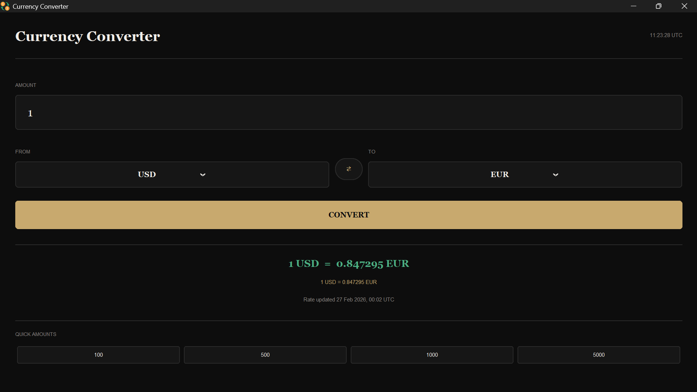

# Exchange — Currency Converter

A dark-themed desktop currency converter built with Python and CustomTkinter. Supports 150+ currencies with live exchange rates fetched from the [ExchangeRate API](https://www.exchangerate-api.com/).


---


## Preview

> Dark terminal-inspired UI with warm gold accents.

---

## Getting Started

### Prerequisites

- Python 3.9 or higher
- A free API key from [open.er-api.com](https://www.exchangerate-api.com/)

### Installation

**1. Clone the repository**
```bash
git clone https://github.com/hamz0640/Currency-converter-in-python.git
cd Currency-converter-in-python
```

**2. Install dependencies**
```bash
pip install -r requirements.txt
```

**3. Set up your API key**

Copy the example env file:
```bash
cp .env.example .env
```

Then open `.env` and replace the placeholder with your actual key:
```
EXCHANGE_API_KEY=your_actual_key_here
```

**4. Run the app**
```bash
python currencyconverter.py
```

---


## Dependencies

| Package | Purpose |
|---|---|
| `customtkinter` | Modern dark-themed UI widgets |
| `requests` | HTTP calls to the exchange rate API |
| `Pillow` | Image handling |
| `python-dotenv` | Loads API key from `.env` file |

Install all at once:
```bash
pip install customtkinter requests Pillow python-dotenv
```

Or generate a `requirements.txt`:
```bash
pip freeze > requirements.txt
```

---

## API Key Setup

This app uses the [ExchangeRate API](https://www.exchangerate-api.com/) (free tier available).

1. Sign up at [exchangerate-api.com](https://www.exchangerate-api.com/) to get your free key
2. Copy `.env.example` to `.env`
3. Paste your key into `.env`


---


## License

This project is licensed under the MIT License. See the [LICENSE](LICENSE) file for details.